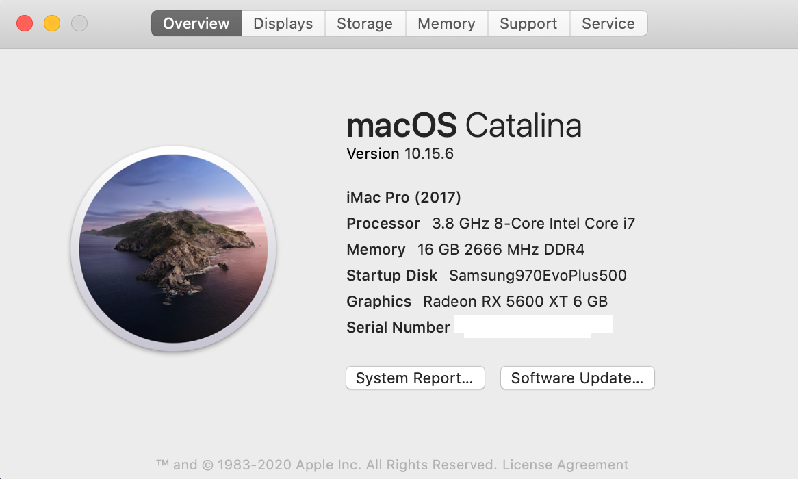
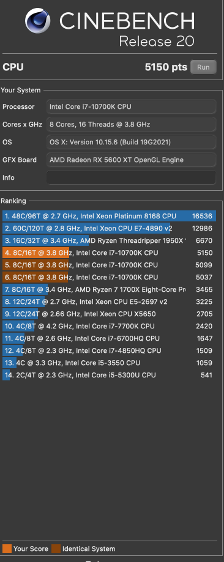
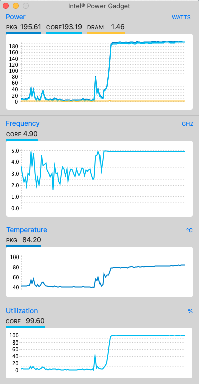
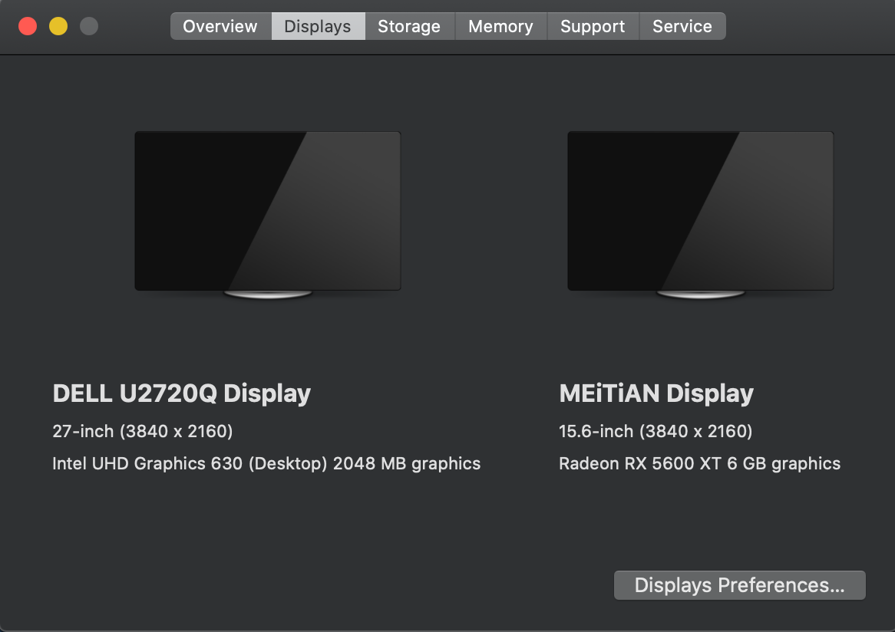

# opencore-asus-z490-i-10700k-5600xt-hackintosh

## Hardware

* Motherboard: Asus ROG STRIX Z490-I
* CPU: Intel® Core™ i7-10700K
* GPU: Sapphire Pulse Radeon RX 5600 XT 6GB DDR6
* RAM: Corsair DOMINATOR® PLATINUM RGB 32GB (2 x 16GB) DDR4 DRAM 3200MHz C16 CMT32GX4M2C3200C16
* SSD: Samsung 970 EVO Plus PCIe NVMe V-NAND M.2 2280 500GB

## Software

* Bootloader: OpenCore 0.6.0
* OS: macOS Catalina 10.15.6

## What's working

- [x] Intel UHD630 (iGPU) Patched 4K 60hz
- [x] AMD Radeon Sapphire 5600 XT (dGPU)
- [x] Audio Realtek ALCS1220A
- [x] Intel I225-V 2.5Gb Ethernet
- [x] USB
- [x] Restart/Shutdown
- [x] Sleep/Wake
- [x] Power Management (Native support)
### Note
To prevent random freeze issue after boot, please disable two features bellow in your BIOS:
* Turbo boost: Disabled
* ASUS Multicore Enhancement: Disabled

## Benchmark

Cinebench

Intel power gadget

## Dual monitor

