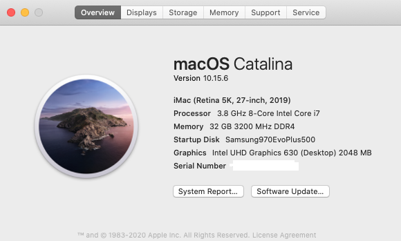

# opencore-asus-z490-i-10700k-5600xt-hackintosh

## Hardware

* Motherboard: Asus ROG STRIX Z490-I
    * Ethernet: Intel I225-V 2.5Gbit
    * Wi-Fi/BT: Intel AX201NGW
    * Audio: Realtek ALCS1220A
* CPU: Intel i7 10700k
* GPU: Intel UHD630 / AMD Radeon Sapphire 5600 XT
* RAM: CORSAIR VENGEANCE LPX DDR4 3200 16GB(×1)
* SSD: Corsair Force Series MP510 240GB NVMe M.2 2280 PCIe Gen 3.0 x4

## Software

* Bootloader: OpenCore 0.5.9
* OS: macOS Catalina 10.15.6

## What's working

- [x] Intel UHD630 (iGPU)
- [x] AMD Radeon Sapphire 5600 XT (dGPU)
- [x] Audio Realtek ALCS1220A
- [x] Intel I225-V 2.5Gb Ethernet
- [x] Wi-Fi/BT (BCM94360CS)
- [x] USB
- [x] Restart/Shutdown
- [x] Sleep/Wake
- [x] Power Management (Native support)
